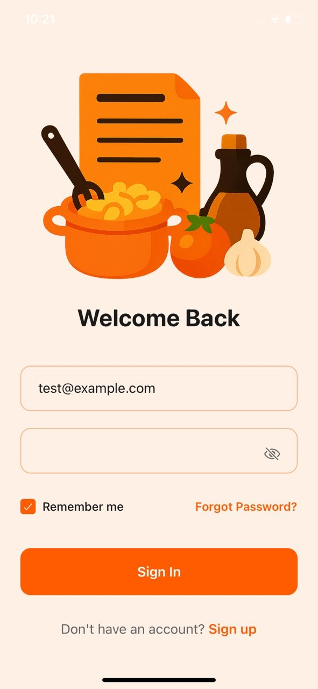
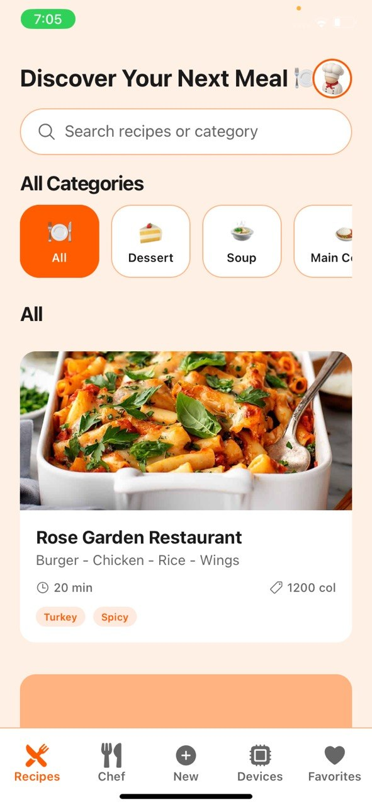
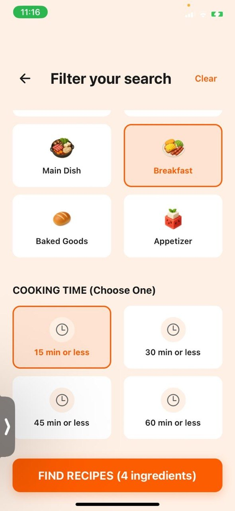
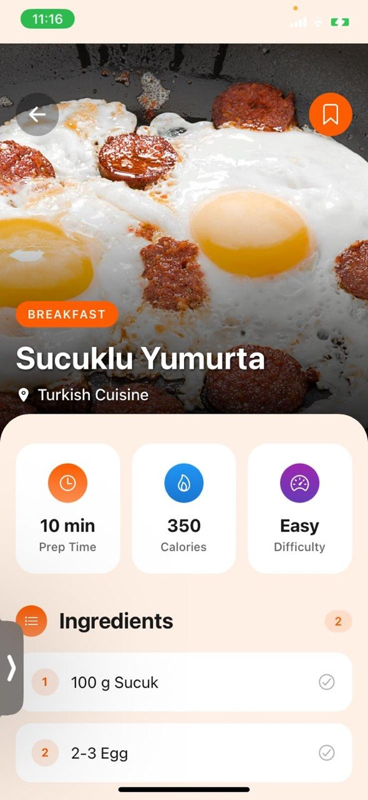
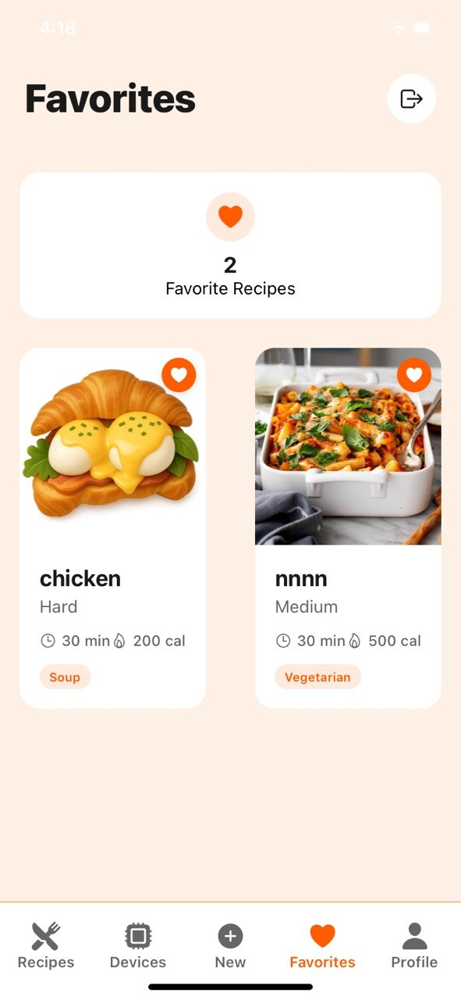
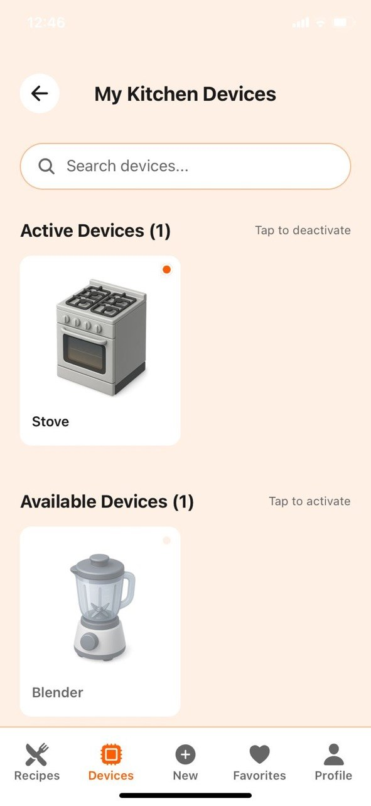
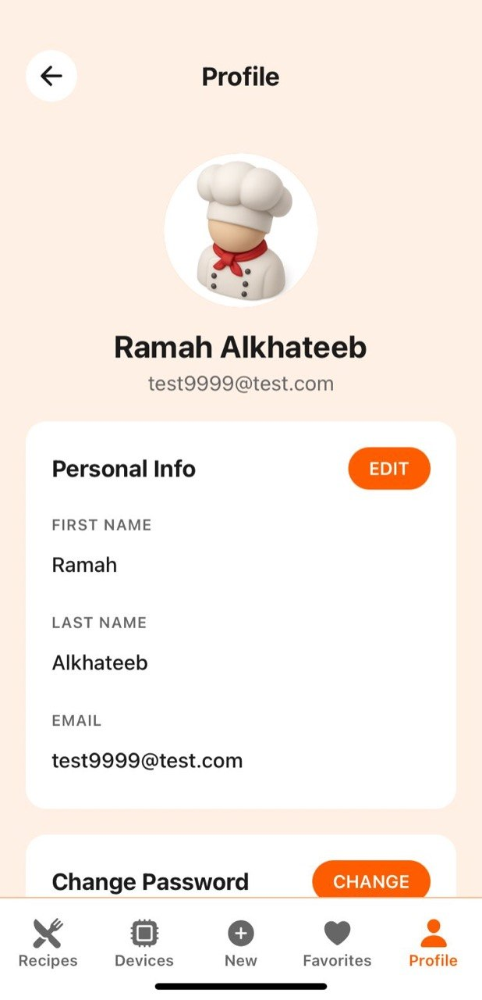

# 🍳 Smart Kitchen Assistant

Cross-platform recipe recommendation mobile application built with React Native (Expo).

Smart Kitchen Assistant helps users discover suitable recipes based on the ingredients and kitchen appliances they have available. The application recommends recipes according to selected ingredients, available devices, meal preferences, and recipe categories to make cooking easier and more personalized.

This project was developed as part of a university Software Engineering course project.

---

## 📱 Features

### 🍽️ Recipe Recommendation

- Recommend recipes based on available ingredients.
- Recommend recipes according to available kitchen appliances.
- Filter recipes by meal type and categories.
- Search recipes by name.
- Browse recipes by category.
- Save favorite recipes.

### 📖 Recipe Details

- View detailed recipe information.
- Follow step-by-step cooking instructions.
- Watch recipe preparation videos through YouTube.

### 👤 User Features

- User registration and login.
- User profile management.
- Personalized recipe experience.

---
## 📸 Application Screenshots

### Authentication & Home

<p align="center">
  
  
</p>

### Recipe Features

<p align="center">
  
  
  
</p>

### User Features

<p align="center">
  
  
</p>
---

## 🛠️ Technologies Used

### Mobile Development

- React Native
- Expo
- JavaScript
- Expo Router
- React Hooks

### Backend Integration

- REST APIs

### Development Tools

- Visual Studio Code
- npm

---

## 👩‍💻 My Contribution – Frontend Mobile Developer

I was responsible for developing the frontend of the mobile application using React Native (Expo).

My responsibilities included:

- Designing and implementing the mobile user interface.
- Developing responsive application screens.
- Building reusable React Native components.
- Integrating the frontend with backend REST APIs.
- Implementing recipe search and filtering interfaces.
- Developing ingredient and kitchen appliance selection screens.
- Implementing favorites and user profile interfaces.
- Improving the overall user experience.

---

## 🤝 Team Contributions

Other team members were responsible for:

- Backend API development.
- Database implementation.
- Admin Dashboard development and management.

---

## 📂 Project Structure

```text
app/
components/
assets/
constants/
context/
hooks/
services/
```

---

## 🚀 Getting Started

### Prerequisites

- Node.js
- npm
- Expo Go

### Installation

Clone the repository:

```bash
git clone https://github.com/ramah202/smart-kitchen-assistant.git
```

Install dependencies:

```bash
npm install
```

Run the application:

```bash
npx expo start
```

Open the application using Expo Go or an Android/iOS emulator.

---

## 🎯 Future Improvements

- AI-powered personalized recipe recommendations.
- Pantry and ingredient inventory management.
- Meal planning.
- Shopping list generation.
- Multi-language support.

---

## 📖 Project Information

- Project Type: University Software Engineering Course Project
- Platform: Cross-platform Mobile Application
- Framework: React Native (Expo)

---

## 📄 License

This project was developed for educational purposes as part of a university Software Engineering course.

---

## 👩‍🎓 Author

**Ramah Alkhateeb**

Software Engineering Graduate

Interested in Frontend Development, Mobile Application Development, and Full-Stack Development.
